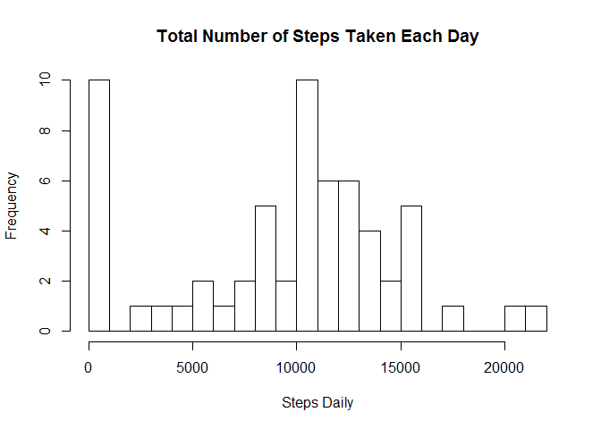
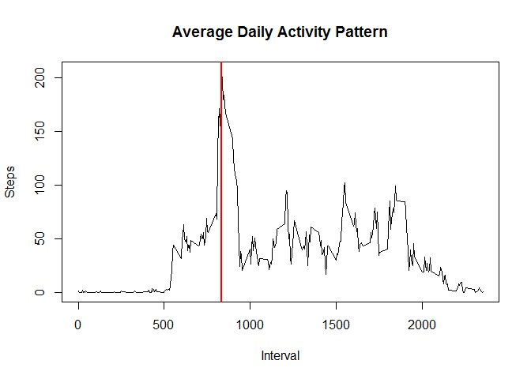
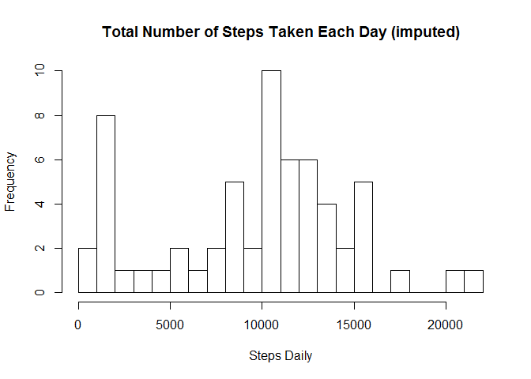
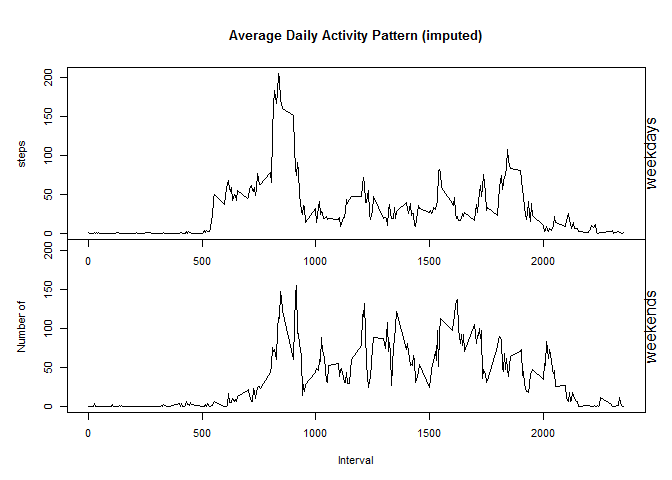

# Reproducible Research: Peer Assessment 1

### by: vmalino

This assignment makes use of data from a personal activity monitoring device. This device collects data at 5 minute intervals through out the day. The data consists of two months of data from an anonymous individual collected during the months of October and November, 2012 and include the number of steps taken in 5 minute intervals each day.

The variables included in this dataset are:

* **steps**: number of steps taking in a 5-minute interval

* **date**: the date on which the measurement was taken

* **interval**: identifier for the 5-minute interval in which measurement was taken

## Loading and preprocessing the data
Getting data (the data file is assumed to be in the working directory)

```r
a <- read.csv("activity.csv", na.strings = "NA")
suppressMessages(require(dplyr)) # The package to process data
```

## What is mean total number of steps taken per day?
Analysis of the daily total steps distribution (histogram, mean, median). NAs are ingored.

```r
# Get the total number of steps per every day
a2 <- a %>% group_by(date) %>% summarize(steps = sum(steps, na.rm = TRUE))
# Histogram of daily total of steps
hist(a2$steps, breaks = 20, xlab = "Steps Daily",
     main = "Total Number of Steps Taken Each Day")
```



Mean of the total number of steps taken per day: 

```r
round(mean(a2$steps, na.rm = TRUE), digits = 0)
```

```
## [1] 9354
```

Median of the total number of steps taken per day:

```r
round(median(a2$steps, na.rm = TRUE), digits = 0)
```

```
## [1] 10395
```

## What is the average daily activity pattern?
Time series plot of the 5-minute interval and the average number of steps taken, averaged across all days. NAs are ignored.

```r
# Get the means by intervals
a4 <- a %>% group_by(interval) %>% summarize(steps = mean(steps, na.rm = TRUE))
plot(x = a4$interval, y = a4$steps, type = "l",
     main = "Average Daily Activity Pattern",
     xlab = "Interval", ylab = "Steps")
# Sorting the data to get the interval with maximum of steps
a5 <- a4 %>% arrange(desc(steps))
abline(v = as.integer(a5[1, 1]), lwd = 2, col = "red")
```



5-minute interval, on average across all the days in the dataset, contains the maximum number of steps (marked with red line on the plot above):

```r
as.integer(a5[1, 1])
```

```
## [1] 835
```

## Imputing missing values
Replacing the missing values (NAs) with an approximation. The total number of NAs: 

```r
nas <- length(a$steps[is.na(a$steps)])
nas
```

```
## [1] 2304
```

The NAs are replaced by median of daily total steps for this interval across all days.  

```r
# Calculate replacments for NAs
a6 <- a %>% group_by(interval) %>% summarise(steps = median(steps, na.rm = TRUE))
# Replace NAs
am <- a
for (i in 1:nrow(am)) {
    if (is.na(am[i, 1])) { am[i, 1] <- a6[a6$interval == am[i, 3], 2] }
}
# Build histogram of the total number of steps taken each day
a7 <- am %>% group_by(date) %>% summarize(steps = sum(steps, na.rm = TRUE))
hist(a7$steps, breaks = 20, xlab = "Steps Daily",
     main = "Total Number of Steps Taken Each Day (imputed)")
```



Mean of the total number of steps taken per day (imputed):

```r
round(mean(a7$steps, na.rm = TRUE), digits = 0)
```

```
## [1] 9504
```

Median of the total number of steps taken per day (imputed):

```r
round(median(a7$steps, na.rm = TRUE), digits = 0)
```

```
## [1] 10395
```
*Once imputed, the mean is increased while median stays the same.*

The % increase of the total daily number of steps (imputed):

```r
round(sum(a7$steps - a2$steps)/sum(a2$steps)*100, 1)
```

```
## [1] 1.6
```

## Are there differences in activity patterns between weekdays and weekends?
Compare the average activity pattern during weekdays and weekends.

```r
# Ensure that locale is English for correct weekdays processing
suppressMessages(curr_locale <- Sys.getlocale("LC_TIME"))
suppressMessages(Sys.setlocale("LC_TIME","C"))
```

```
## [1] "C"
```

```r
# Add a weekday column
am <- am %>% mutate(day = weekdays(as.Date(date)))
# Convert weekday to weekend/weekday factor
am$day <- sapply(am$day, function(x) {
    if (x %in% c("Saturday", "Sunday")) {"weekend"} else {"weekday"}
})
am$day <- as.factor(am$day)
# Restore locale
suppressMessages(Sys.setlocale("LC_TIME",curr_locale))
```

```
## [1] "Polish_Poland.1250"
```

```r
# Plot two patterns in panels
par(mfrow = c(2, 1), cex = 0.7, mar = c(0, 5, 5, 2))
amd <- am %>% filter(day == "weekday") %>% group_by(interval) %>%
    summarize(steps = mean(steps))
ame <- am %>% filter(day == "weekend") %>% group_by(interval) %>%
    summarize(steps = mean(steps))
# Range to align Y axis on both plots
rng <- range(ame$steps, amd$steps)
plot(x = amd$interval, y = amd$steps, type = "l", ylim = rng,
     main = "Average Daily Activity Pattern (imputed)",
     xlab = "", ylab = "steps")
mtext("weekdays", side = 4, outer = FALSE)
par(mar = c(5, 5, 0, 2))
plot(x = ame$interval, y = ame$steps, type = "l", ylim = rng,
     xlab = "Interval", ylab = "Number of")
mtext("weekends", side = 4, outer = FALSE)
```



The noted differences between weekdays and weekends patterns:

* The weekday pattern has higher peek activity somewhere in the morning

* The weekend pattern has lower peek, but more evenly distributed activity alond the day
